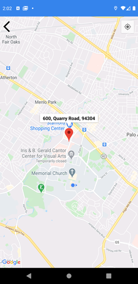

# LingoChat - Android
In today’s life, we interact with so many people on daily basis. Communication is a key part in everyone’s life but what happens when you two people don’t speak the same language.
 This project aims to create an instant messaging app. The major feature of the application is that the user will be able to chat in their native language and the incoming message from the other user will automatically be converted into their native language.

### Features
If an English-speaking person is talking to a French speaking person, the messages sent by the English-speaking person will be automatically be converted into French when received by the French speaking person and also the messages sent by French speaking person will automatically be converted into English when received.
 The application will support 5 languages at first namely:
- English
- French
- German
- Spanish
- Hindi

The application will also support general instant messaging features such as:
- Image sharing
- Video sharing
- Document sharing
- Location sharing 

We also aim to bring localization to the application so that every text in the application is understandable to the user and will appear in their native language.
 

### Startup Screen

  

 

### SignUp Screen

  

 

### SignIn Screen

  

 

### Settings Screen

  

 

### Chats Screen

  

 

### Chatting Screen

  

 

### Chatting with Information Screen

  

 

### Sending infromation

  

 

### Location Screen

  

 
